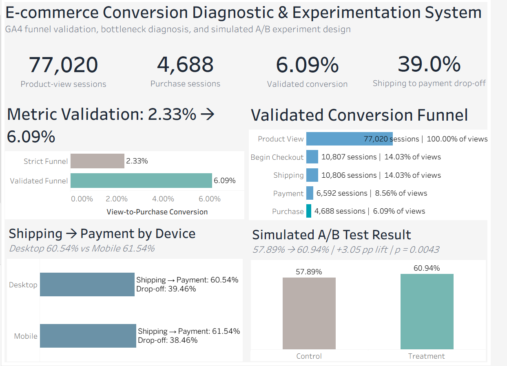

# E-commerce Conversion Diagnostic & Experimentation System

## Executive summary

This project uses the Google Analytics 4 public e-commerce dataset in BigQuery to answer:

> **Where is the most reliable conversion bottleneck in the checkout journey, and what experiment should the product team run to improve conversion?**

A strict sequential funnel initially reported **2.33% view-to-purchase conversion**. Instead of accepting that result, the event paths were validated. The strict definition was found to exclude legitimate downstream journeys, including **4,855 of 10,807 checkout sessions with no recorded `add_to_cart` event**.

After correcting the metric definition, the validated business funnel was:

**77,020 product-view sessions → 10,807 checkout → 10,806 shipping → 6,592 payment → 4,688 purchase**

Validated view-to-purchase conversion: **6.09%**.

The most reliable downstream bottleneck was **shipping → payment**, with about **39% drop-off**. Desktop (**60.54%**) and mobile (**61.54%**) were nearly identical, so the evidence did not support a device-specific explanation.

## Dashboard



## Data

Dataset: `bigquery-public-data.ga4_obfuscated_sample_ecommerce`

- **4,295,584 events**
- **270,154 users**
- **92 days**

## Funnel validation

### Strict ordered funnel

**77,020 → 15,167 → 5,416 → 3,119 → 2,438 → 1,792**

Strict view-to-purchase conversion: **2.33%**

### Why it changed

The strict definition required every intermediate event to be present in order. Validation showed that GA4 paths often skipped or lacked intermediate events:

- `begin_checkout`: **11,106 unordered vs 5,416 strict**
- `purchase`: **4,848 unordered vs 1,792 strict**
- **4,855 of 10,807 checkout sessions had no recorded `add_to_cart` event**
- **4,688 of 4,688 validated purchase sessions had a payment event**

The gap between **2.33%** and **6.09%** is therefore a metric-definition/data-quality finding, not a change in customer behavior.

## Business diagnosis

The validated downstream path showed:

**10,806 shipping sessions → 6,592 payment sessions → 4,688 purchases**

- Shipping → payment progression: **~61%**
- Shipping → payment drop-off: **~39%**

Device check:

- Desktop: **60.54%**
- Mobile: **61.54%**

Conclusion: the bottleneck is broad rather than device-specific.

## Experiment design

Each user entered the experiment once at their first eligible shipping-stage session.

- Eligible users: **9,552**
- Payment users: **5,459**
- User-level baseline: **57.15%**
- Payment → purchase guardrail baseline: **70.54%**

Design:

- MDE: **+3 pp**
- Target: **60.15%**
- Alpha: **0.05**
- Power: **80%**
- 50/50 allocation
- Two-sided test
- Required sample: **4,229 users per arm**

### Experiment QA

A/A split:

- A: **4,772 users**, **57.75%** conversion
- B: **4,780 users**, **56.55%** conversion
- SRM p-value: **0.9348**
- A/A p-value: **0.2339**

Monte Carlo validation over **10,000 simulations**:

- Empirical power: **80.21%**
- Empirical false-positive rate: **5.05%**

## Simulated A/B result

> **Important:** treatment outcomes are simulated, not from a live production experiment.

- Control: **57.89%**
- Treatment: **60.94%**
- Absolute lift: **+3.05 pp**
- Relative lift: **+5.27%**
- 95% CI: **+0.96 to +5.14 pp**
- p-value: **0.0043**

Guardrail:

- Control payment → purchase: **70.71%**
- Treatment payment → purchase: **72.18%**
- Difference: **+1.47 pp**
- 95% CI: **−1.03 to +3.96 pp**
- Predefined harm tolerance: **−2 pp**

Simulated decision: **PASS**.

## Business recommendation

Test a **broad shipping-to-payment checkout intervention** rather than a device-specific redesign.

The GA4 data identifies the bottleneck but does not establish its cause. UX friction, shipping-cost surprise, form complexity, and payment concerns should remain hypotheses until tested in a live experiment.

## Skills demonstrated

BigQuery, SQL, GA4 nested event analysis, funnel validation, metric design, A/B testing, A/A testing, SRM checks, power/sample-size analysis, MDE sensitivity, Monte Carlo validation, two-proportion testing, confidence intervals, guardrails, Tableau, business recommendation.

## Repository structure

```text
sql/
  GA4_Funnel_All_SQL_Final.sql
  13_experiment_unit_baseline.sql
  14_experiment_population_aa.sql

python/
  01_power_sample_size.py
  02_mde_sensitivity.py
  03_aa_validation.py
  04_power_validation.py
  05_final_ab_experiment.py

docs/
  EXECUTIVE_SUMMARY.md
  RESUME_AND_INTERVIEW.md

tableau/
  GA4_Tableau_Inputs.xlsx
  Add your final .twb/.twbx and dashboard export here.
```

## Limitations

- GA4 event presence does not establish causal reasons for abandonment.
- The experiment baseline is user-level (**57.15%**) while the funnel diagnostic is session-level (~**61%**) because they answer different questions.
- Treatment results are simulated.
- The +3 pp MDE and −2 pp guardrail tolerance are design assumptions.
- No revenue or implementation-cost data was available to establish an economic break-even threshold.
